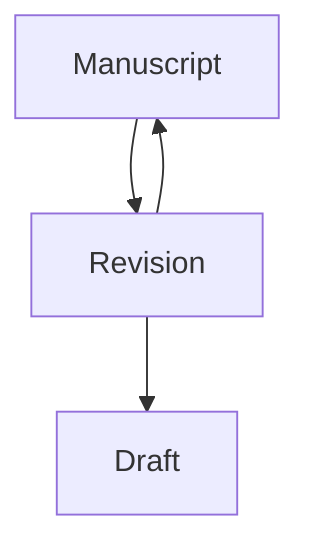
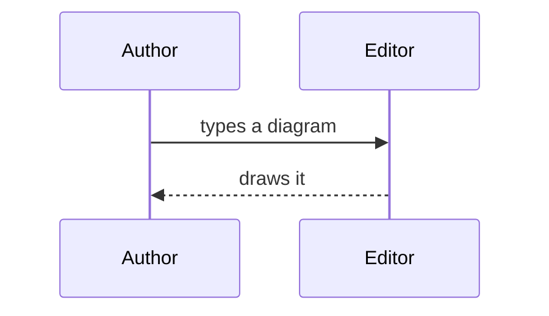
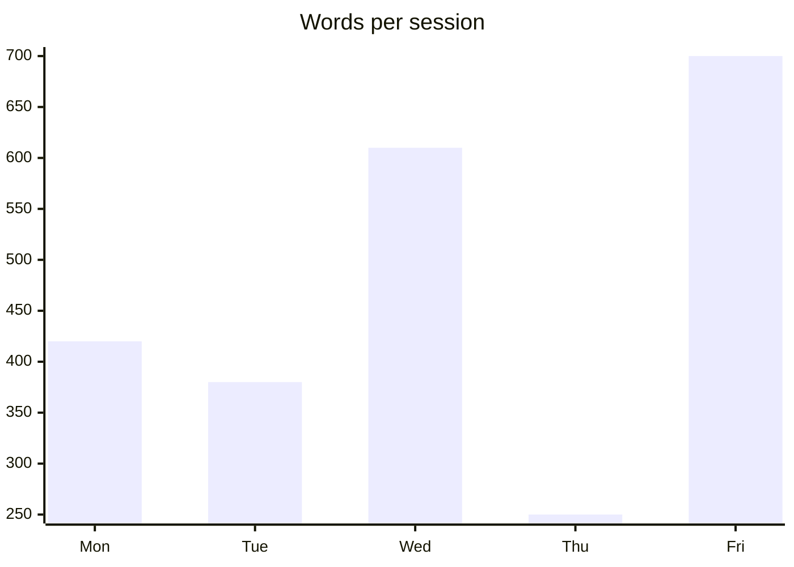

# Diagrams

A **Diagram** is a **Code block** whose info string is `mermaid`: you write
its source in the **Chapter**, and the **Writing editor** composes it as the
picture that source describes.

It is the one construct in the editor that is *drawn* rather than styled —
everything else, a **Table**'s grid included, is decoration over the
characters you typed. See [markdown.md](markdown.md) for the rest of the
**Composed subset**, and [tables.md](tables.md) for **Tables**.

## Writing one

````markdown

````

With the cursor away from the block, the fences and the source are replaced
by the picture. Put the cursor anywhere inside and the whole block turns
back into the source — never half source, half picture: a picture has no
"the bit under the cursor". Clicking the picture is the other way in; moving
the cursor out draws it again.

**Your file only ever holds the source you wrote.** Nothing is inserted, no
SVG is written back, and no image file is created anywhere. Open the same
`.md` in any other editor and you see the mermaid source, exactly as you
left it. Its contents are not counted by the word count either — a
**Diagram source** is a program, not prose.

### The fence

Only the first word of the info string decides, and case does not matter:

| Info string | Composed? |
| --- | --- |
| ` ```mermaid ` | Yes |
| ` ```Mermaid ` | Yes |
| ` ```mermaid theme=neutral ` | Yes — extra words are ignored |
| ` ```mermaidjs ` | No — an ordinary **Code block** |

That is how every other markdown tool reads an info string; a prefix match
would compose a **Code block** you meant to keep as code.

## What can be drawn

Six kinds, from the renderer this editor bundles (`beautiful-mermaid`):

| Kind | Starts with |
| --- | --- |
| Flowchart | `graph TD` / `flowchart LR` — `TD`, `LR`, `BT`, `RL` all work |
| Sequence | `sequenceDiagram` |
| Class | `classDiagram` |
| State | `stateDiagram-v2` |
| Entity–relationship | `erDiagram` |
| XY chart (bar, line, or both) | `xychart-beta` |





Flowcharts and state diagrams also take `linkStyle` to colour individual
edges (`linkStyle 0 stroke:#f00`, `linkStyle default stroke:#888`).

Mermaid syntax outside those six — `pie`, `gantt`, `journey`, `mindmap` and
the rest — is not drawn. The block stays a **Code block** showing your
source, which is also what a half-written **Diagram** shows while you are
still typing it: a source that cannot be drawn is never an error message,
just its own text.

## How it is set on the page

A composed **Diagram** is a **Diagram plate**: an object placed in the
prose rather than prose itself. It gets its own ground, it is centred, and
when it is wider than the measure it is scaled down rather than allowed to
bleed into the margins — a picture cannot reflow the way a **Table** wraps.

It also carries **its own palette**, not the **Editor theme**'s: the
renderer's `github-light` and `github-dark`. Light and dark themes map
straight across; the `vscode` theme follows whichever kind of theme VSCode
has active. Change the theme and every **Diagram** is redrawn in the other
palette.

## Offline, and by the page

- **Nothing is fetched from the network.** The webview's Content Security
  Policy admits no remote origin, and the one remote font import the
  renderer emits is stripped before the picture reaches the page, so opening
  a **Chapter** never reaches for the internet.
- **The renderer is downloaded only by a Chapter that has a Diagram in it.**
  It is a separate ~1.5 MB bundle, loaded once per webview, on demand. A
  **Chapter** with no **Diagram** never pays for it.
- **Drawn pictures are cached** by source *and* palette, so scrolling,
  typing elsewhere and moving the cursor never redraw the same picture.
- **If the renderer cannot be loaded at all**, every **Diagram** falls back
  to showing its source. A worse **Writing surface**, never a broken one.

## Why it is built this way

The **Diagram** is the single widget in the **Live preview**, and the
reasoning for spending that exception — plus why its renderer is a bundle of
its own — is in
[../adr/0004-a-diagram-is-the-one-widget.md](../adr/0004-a-diagram-is-the-one-widget.md).
The vocabulary (**Diagram source**, **Diagram language**, **Diagram plate**)
is fixed in [../UBIQUITOUS_LANGUAGE.md](../UBIQUITOUS_LANGUAGE.md).
